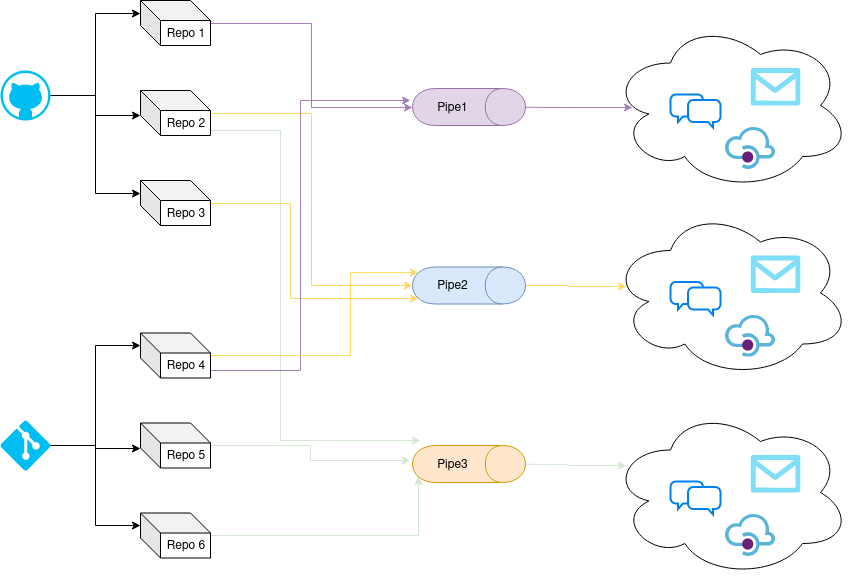

# Changelogger

Collect change logs from selected repos, and notify users about updates.



## Install local copy

For run this project localy, you need to had installed on your system:
- make
- docker
- docker compose v2

#### Prepare to run
```bash
make compose-prepare
```

#### Run system
```bash
make compose-web
```

## TODO
- Bitbucket support
- Native GIT repo support
- Gillab groups and users support
- Github organisations and users support
- OIDC auth for internal repos
- Flexible notifier (not only email, but chat bots, and other interfaces)
- Conventional Commits autologger